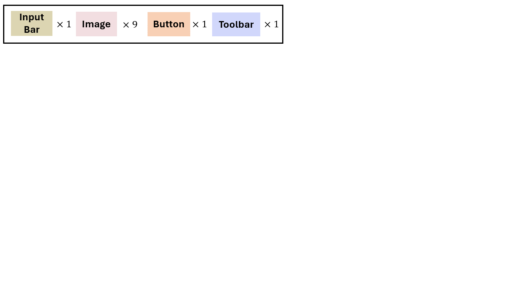
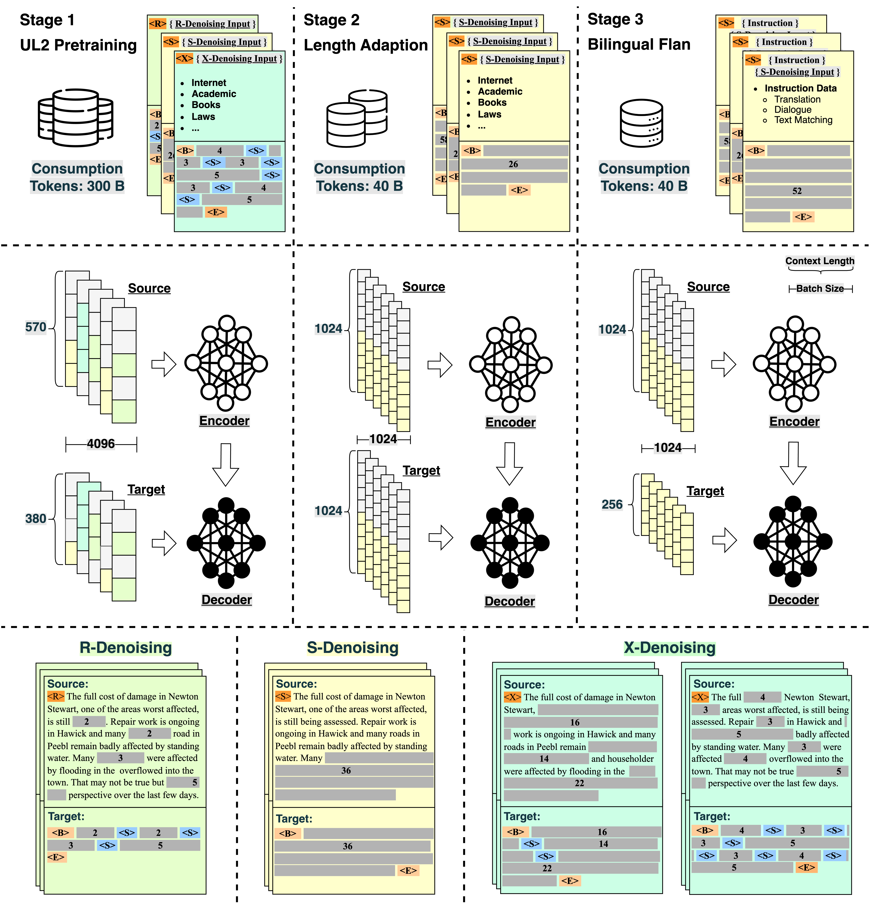

# 🔥 News
<!-- 
- ``Sep 2023`` [LayoutNUWA: Revealing the Hidden Layout Expertise of Large Language Models](https://arxiv.org/abs/2309.09506) We have released LayoutNUWA, the first model that treats layout generation as a __code generation__ task to enhance semantic information and __harnesses the hidden layout expertise of large language models__. 

 
    

 

- ``Sep 2023`` [OpenBA: An Open-Sourced 15B Bilingual Asymmetric Seq2Seq Model Pre-trained from Scratch](https://arxiv.org/abs/2309.10706) We have released OpenBA, an open-sourced 15B bilingual asymmetric seq2seq model. The entire training process, data sources, collection, and construction are made fully open-source! 

 
    

 
-->
